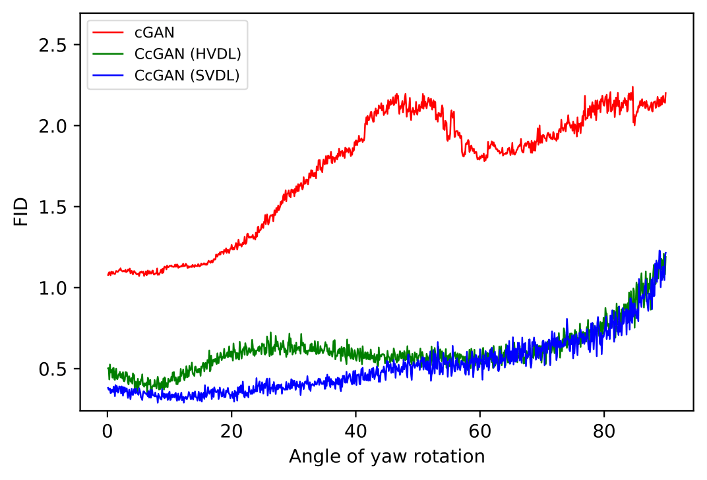

# Continuous Conditional GAN (CcGAN)

If you use this code, please cite
```text
placeholder...
```


# 1. Datasets
## RC-49 Dataset (h5 file)
https://1drv.ms/u/s!Arj2pETbYnWQr7MY2Pr5qipSUpZKEQ?e=k8HfB6

Download 'RC-49_64x64.h5' and put it in './CcGAN/dataset/RC-49'

## modified UTKFace Dataset (h5 file)
https://1drv.ms/u/s!Arj2pETbYnWQr7MW_sGY9tJC4G3eMw?e=gmTA0w

Download 'UTKFace_64x64.h5' and put it in './CcGAN/dataset/UTKFace'


# 2. Sample Usage
## 2.1 Simulation ('./CcGAN/Simulation')
First, set the ROOT_PATH in the 'run_train.sh' to yours. 

Then, run 'run_train.sh'.


## 2.2 RC-49 ('./CcGAN/RC-49')
First, set the ROOT_PATH and DATA_PATH in the 'run_train.sh' to yours. 

Then, run 'run_train.sh'.


## 2.3 UTKFace ('./CcGAN/UTKFace')
First, set the ROOT_PATH and DATA_PATH in 'run_train.sh' to yours. 

Then, run 'run_train.sh'.


# 3. Some results

## 3.1 Simulation: Circular 2-D Gaussians
### Training data
 

### cGAN


### HVDL


### SVDL


## 3.2 RC-49
### Visual Comparison
 

### FID vs Angle
 

### NIQE vs Angle
 

### Diversity vs Angle
 


## 3.3 UTKFace
### Visual Comparison
 

### FID vs Angle
 

### NIQE vs Angle
 

### Diversity vs Angle
 
